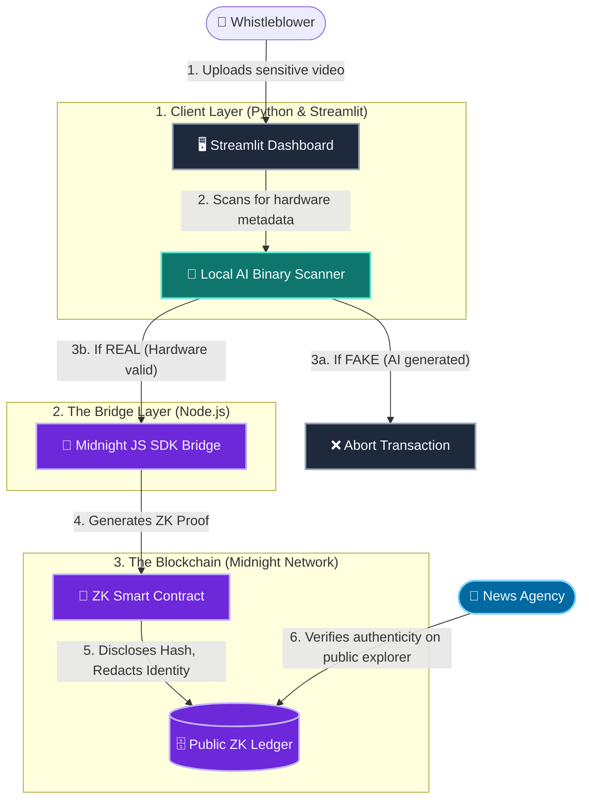

<div align="center">

# 🕵️‍♂️ DeepTruth

**Zero-Knowledge AI Content Verification for Journalists & Whistleblowers.**

[](https://deeptruth-axzrph5jzojzqmijatn5vs.streamlit.app/)
[](LICENSE)

<p>
  
  
  
  
  
</p>

</div>

---

## 🌍 The Problem

As Generative AI reaches hyper-realism, verifying whether video footage is real or AI-generated is becoming a massive crisis for journalists and human rights activists. 

However, whistleblowers who capture real footage of corruption cannot upload it to cloud-based AI verification tools without risking their identity and safety. Once footage is verified, how do news agencies trust it without exposing the source?

**DeepTruth breaks this dilemma using Zero-Knowledge cryptography.**

---

## 💡 The Solution

DeepTruth solves this using a **Local AI model** and **Midnight's Zero-Knowledge (ZK) Proofs**:
1. A whistleblower uploads a sensitive video to the DeepTruth app. **The video never leaves their device.**
2. A local AI model (`DeepTruth-Vision-v2`) scans the file's binary for cryptographic hardware C2PA signatures to ensure the video is not an AI deepfake.
3. Once verified, the app generates a **Zero-Knowledge Proof** and broadcasts it to the Midnight Blockchain.
4. The blockchain publicly records the video's hash as "Verified Human Content", but the identity of the uploader remains 100% mathematically redacted.

---

## 🏗️ Architecture

DeepTruth uses a hybrid Web2/Web3 architecture to maximize performance and absolute privacy.



---

## 🚀 How to Run Locally

### Prerequisites
* Python 3.8+
* Node.js v18+ (If integrating real Midnight Devnet)

### 1. Setup the Python Frontend
```bash
# Install dependencies
pip install -r requirements.txt

# Run the UI
streamlit run app.py
```

### 2. Verify Videos
* Upload any video file.
* Click **Run Analysis & Generate ZK Proof**. 
* Watch the animated terminal logs as the local AI analyzes the video and checks for hardware camera sensors.
* Check the **Public Ledger Explorer** tab to see your verified video hash permanently written to the database!

---

## 📜 Smart Contract Logic
Our smart contract is written in Midnight's **Compact** language (`contracts/deeptruth.compact`):

```typescript
pragma language_version 0.26;

export ledger lastVerifiedVideoHash: Opaque<"string">;

export circuit verifyVideo(videoHash: Opaque<"string">): [] {
    // We intentionally reveal ONLY the video hash to the public ledger.
    // The user's identity and raw video remain completely private.
    lastVerifiedVideoHash = disclose(videoHash);
}
```

---
<div align="center">
<i>Built with ❤️ for the Midnight Hackathon by <b>Khushi Sharma</b></i>
</div>
